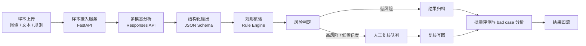

# Driving Scene Multimodal Review Workbench

面向自动驾驶 / 道路场景的多模态质检、评测与人工复核工作台。

本项目接收道路场景图像或图文样本，自动完成场景分析、结构化结果生成、规则核验和风险判定，并将低置信度或高风险样本送入人工复核队列。同时支持批量评测、bad case 分析和结果回流，重点展示多模态 AI 应用、结构化输出、工作流编排与 human-in-the-loop 工程能力。

> 当前状态：项目规划阶段。本文档用于对外展示项目目标和最终交付形态，详细开发规划见 [docs/project-plan.md](docs/project-plan.md)。

## 项目亮点

- 多模态输入：支持道路场景图像，以及可选的上下文文本、参考标注和规则模板。
- 结构化输出：使用固定 schema 约束模型结果，避免自由文本难以评测和回流。
- 规则核验：用显式规则检查字段完整性、枚举合法性和场景逻辑一致性。
- 风险判定：根据低置信度、规则冲突、字段缺失和异常解释标记风险等级。
- 人工复核：高风险样本进入复核队列，由人工批准、修改、驳回或重新分析。
- 批量评测：支持离线样本集跑数，统计 schema 合规率、字段完整率、规则冲突率、人工复核率和 bad case。
- 轻量工作台：提供上传、结果详情、人工复核和批量评测四类核心页面。

## 系统架构



## 功能规划

### 1. 样本上传

- 上传道路场景图片。
- 填写可选上下文，例如任务说明、标注规范或已有模型输出。
- 选择规则模板或评测配置。
- 创建分析任务并返回 `task_id`。

### 2. 多模态分析

- 调用多模态模型理解道路场景。
- 抽取场景类型、关键对象、潜在问题、缺失标注和解释。
- 通过结构化输出保证字段稳定。

### 3. 规则核验与风险判定

- 检查必填字段是否缺失。
- 检查枚举值是否合法。
- 检查场景标签与关键对象是否冲突。
- 根据规则冲突、置信度和异常解释计算风险等级。

### 4. 人工复核

- 展示待复核样本队列。
- 支持批准、编辑、驳回和重新分析。
- 保存人工修正结果和复核意见。

### 5. 批量评测

- 对样本集批量执行分析和核验流程。
- 输出指标汇总、风险分布和 bad case 列表。
- 有人工标注或真值时，进一步计算准确率、F1、误报和漏报。

## 技术栈

- 后端：Python, FastAPI, Pydantic
- 工作流：LangGraph
- 模型接口：OpenAI Responses API
- 输出约束：Structured Outputs, JSON Schema
- 存储：SQLite first, PostgreSQL optional
- 前端：React
- 评测：Python scripts, batch evaluation reports

## 仓库结构

仓库按后端服务、前端工作台、批量评测、样例数据、规则配置和文档分层组织。详细说明见 [docs/repository-structure.md](docs/repository-structure.md)。

```text
.
├── backend/        # FastAPI 后端服务
├── frontend/       # React 轻量工作台
├── evals/          # 批量评测与 bad case 分析
├── data/           # 本地样本、上传文件和导出结果
├── configs/        # 规则模板与运行配置
└── docs/           # 项目规划、API 设计、结构说明
```

## 快速启动

项目尚处于规划阶段，代码实现后会补充完整启动方式。预期本地启动方式如下：

```bash
# 后端
cd backend
pip install -r requirements.txt
uvicorn app.main:app --reload

# 前端
cd frontend
npm install
npm run dev
```

## API 示例

预期核心接口如下，具体字段会随实现更新。

```http
POST /api/samples/analyze
Content-Type: multipart/form-data

image=@road_scene.jpg
context_text=Check whether the scene label and key objects are reasonable.
rule_profile=default_driving_scene
```

示例响应：

```json
{
  "task_id": "sample_001",
  "scene_type": "urban_intersection",
  "key_objects": ["traffic_light", "crosswalk", "vehicle", "pedestrian"],
  "issues": ["possible_missing_pedestrian_label"],
  "confidence": 0.78,
  "rule_pass": false,
  "risk_level": "needs_human_review",
  "review_status": "pending"
}
```

## 界面截图

截图将在前端 MVP 完成后补充：

- 样本上传页
- 结果详情页
- 人工复核页
- 批量评测页

## 简历描述

设计并实现面向自动驾驶 / 道路场景的多模态质检、评测与人工复核工作台。系统支持图像 / 图文输入、结构化结果生成、规则核验、风险分级、人工复核与批量评测，采用 LangGraph 编排工作流、FastAPI 提供服务接口，并通过 Structured Outputs 保证结果 schema 合规。项目重点体现多模态应用开发、工作流编排、质量评测与 human-in-the-loop 工程能力。
